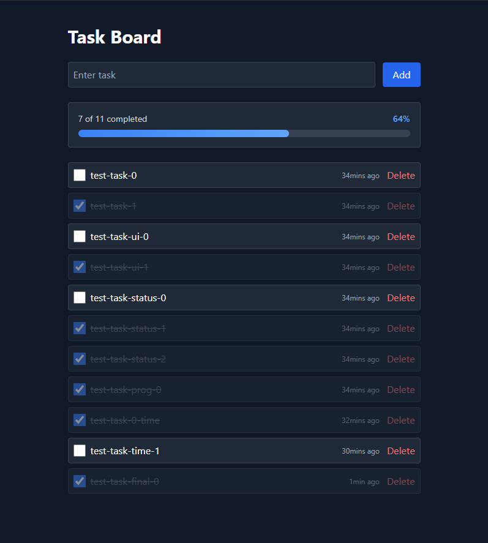

# Task Board

A simple, modern task management web application that lets you create, track, and complete tasks in a beautiful dark-themed interface.

## What It Does

Task Board is a lightweight full-stack web app for managing your to-do list. You can:

- Add new tasks by typing and pressing Enter or clicking Add
- Mark tasks as complete/incomplete with a checkbox
- Delete tasks when you're done with them
- Track progress with a visual progress bar showing completion percentage
- See how long ago each task was created

## User Interface

Here's what the app looks like:



Features visible in the UI:
- Input field to add new tasks
- Progress bar showing X of Y tasks completed with percentage
- Task list items with checkboxes
- Timestamps showing how long ago tasks were created
- Delete buttons for removing tasks
- Completed tasks show with strikethrough and dimmed appearance

## How It Works

1. **Add a Task**: Type your task name in the input field and press Enter or click the Add button. Tasks are created with incomplete status by default.

2. **Complete a Task**: Click the checkbox next to a task to mark it as done. Completed tasks appear dimmed and crossed out.

3. **Delete a Task**: Click the Delete button on any task to remove it permanently.

4. **Track Progress**: The progress bar automatically updates as you complete tasks. It shows the exact count and percentage in a visual bar format.

5. **View Timestamps**: Each task displays how long ago it was created. This updates automatically every minute.

## Tech Stack

**Backend:**
- Python with Django framework
- Django REST Framework for API endpoints
- SQLite database for task storage

**Frontend:**
- React with Vite as the bundler
- Axios for HTTP requests to the backend
- Tailwind CSS for styling
- Modern ES6+ JavaScript

**Deployment:**
- Frontend runs on localhost:5173 (Vite dev server)
- Backend runs on localhost:8000 (Django dev server)

## Project Structure

```
d:\Projects\Full Stack\Task List Management
|
├── backend/
│   ├── manage.py
│   ├── config/               # Django settings and URLs
│   └── tasks/                # Task model and views
│
├── frontend/
│   ├── src/
│   │   ├── App.jsx          # Main React component
│   │   ├── main.jsx         # Entry point
│   │   ├── App.css          # Styling
│   │   └── index.css        # Global styles
│   ├── package.json
│   ├── vite.config.js
│   └── tailwind.config.js
│
└── Screenshots/              # UI screenshots
```

## Notes

- The backend uses SQLite by default for local development. Switch to PostgreSQL or another database in production.
- CORS is configured to accept requests from the frontend on localhost. Update CORS settings in Django for production.
- Timestamps are stored in UTC and converted to relative time (ago) on the frontend for better UX.

Enjoy organizing your tasks!
